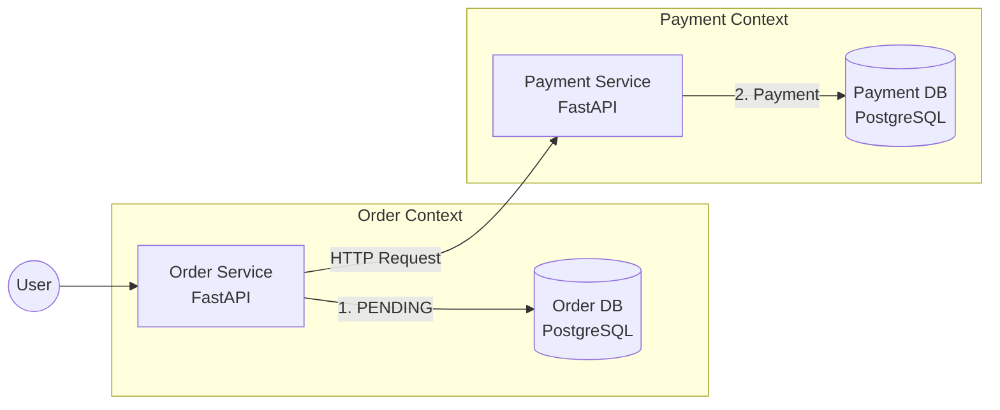

# Microservices Saga Pattern PoC

マイクロサービスアーキテクチャにおける「分散トランザクション（データ整合性）」の課題を検証するための PoC（概念実証）プロジェクトです。

**Saga パターン（オーケストレーション）** を実装し、決済サービスの障害発生時に、確定済みの注文データを自動的に取り消す「補償トランザクション（Compensating Transaction）」の挙動を再現しています。

🔗 **解説記事 (Zenn):** 
https://zenn.dev/shayate811/articles/microservices-saga-poc

## 🏗 Architecture

**Database Per Service** パターンを採用し、各サービスは独立したデータベースを持ちます。



## 🛠 Tech Stack

Language: Python 3.11

Framework: FastAPI

Database: PostgreSQL 15

Infrastructure: Docker, Docker Compose

ORM: SQLAlchemy 2.0 (Async/Sync)

## 🚀 Quick Start

Docker Compose を使用して、ローカル環境にマイクロサービス群を即座に立ち上げることができます。

```bash
# リポジトリのクローン
git clone [https://github.com/shayate811/microservices-saga-poc.git](https://github.com/shayate811/microservices-saga-poc.git)
cd microservices-saga-poc

# コンテナのビルドと起動
docker-compose up --build
```

起動後、以下のエンドポイントが利用可能になります。

Order Service: http://localhost:8000

Payment Service: http://localhost:8001

## 🧪 Scenarios (Verification)

この PoC では、特定の金額を入力することで「正常系」と「異常系（Saga 発動）」をテストできます。

Case 1: Happy Path (正常終了)
通常の注文処理です。注文ステータスは COMPLETED になります。

```bash
curl -X POST "http://localhost:8000/orders/" \
 -H "Content-Type: application/json" \
 -d '{"item_name": "Apple", "quantity": 1, "price": 100}'
```

Case 2: Saga Compensation (異常系・補償トランザクション)
金額に 9999 を指定すると、決済サービス側で意図的に 500 Internal Server Error が発生します。 Order Service はこれを検知し、一度 PENDING でコミットされた注文を CANCELLED に更新（補償）します。

```bash
curl -X POST "http://localhost:8000/orders/" \
     -H "Content-Type: application/json" \
     -d '{"item_name": "Bomb", "quantity": 1, "price": 9999}'
```

期待される挙動 (Logs):

Order Created (PENDING)

Payment Failed (500 Error)

Compensating Transaction executed (CANCELLED)

## 📂 Directory Structure

```
microservices-saga-poc/
├── docker-compose.yml   # サービス構成とネットワーク定義
├── order_service/       # 注文サービス (Orchestrator)
│   ├── src/
│   │   ├── main.py      # Sagaロジックの実装
│   │   └── ...
└── payment_service/     # 決済サービス
    ├── src/
        ├── main.py      # 9999円でエラーを吐く仕掛け
        └── ...
```
